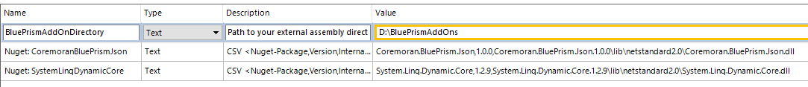
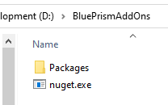

# Coremoran - Dynamic LINQ
- [License](LICENSE)

This library performs LINQ queries onto [BluePrism](https://www.blueprism.com/) collections.
This is a wrapper to enable access to the functionality of [Dynamic LINQ](https://dynamic-linq.net/). This library enables access to LINQ expressions wrapping lambdas into strings.

There is no deferred execution. Usually an expression takes a BluePrism collections and results in a collection.

Furthermore this VBO shows a way to deal with NuGet packages in BluePrism. There is no need to put the NuGet assembly into the BluePrism installation directory which is often impossible due to insufficent rights. You can configure a local drive or a network share to load the assembly from. Even if NuGet isn't reachable e.g. due to company policies, you can install the packages from a cache directory.

## Installation

Simply install the ```.bprelease``` file. This installs the VBO and three environment variables.

There is another ```.bprelease``` file which contains BluePrism unit tests for the VBO. This package needs the [Coremoran - Utility - JSON](https://github.com/toarnold/Coremoran.BluePrism.Json) VBO.

### Configuration

In BluePrism go to System -> Objects -> Environment Variables



The ```Nuget: ...``` variable is a csv (comma separated value) and has the following scheme ```<NuGet-Package-Name,Package-Version,Relativ-Assembly-Path-inside-the-package>```.
If multiple VBOs are using this package all should reference and use this environment variable to avoid assembly-version-hell.

Configure ```BluePrismAddOnDirectory``` to an existing directory. This directory will hold your expanded NuGet packages and other assemblies if needed.

Download the latest [nuget.exe](https://www.nuget.org/downloads) version and place it in this directory

Inside this directory create a folder named ```Packages```. If you are behind a corporate proxy and Nuget isn't reachable download the needed packages and place them inside the ```Packages``` folder.

The result should look like



## Challenges

1. Valid BluePrism collection columns names aren't potentially valid C#/VB.NET variable names, so you might not be able to use them in expressions easily.
1. Because all values are stored in .NET ```DataTables``` all values are boxed into ```Objects```. This values will be converted to ```Newtonsoft.Json.Linq```  data types internally - thus, you might be forced to cast every value into it's .NET data type to use it as value e.g. ```Decimal(numberValue) > 1```.
1. Dynamic LINQ supports parameter, but you have to know the parameter order to reference them in expressions e.q. ```Decimal(numberValue) > @0```. But, this is off your hands.

## Solutions

To address the variable name and data type challenge exists a macro ```#{column name}```. This macro adds a type cast if possible, so you can use ```#{column name} > 1``` instead of e.g. ```Decimal(it["colum name"]) > 1```.

All parameters have to be a column in a single row collection. Referencing a parameter by name can be done by ```${parameter name}```. So it is possible to write the following expression: ```#{column name}  > ${parameter name}```.